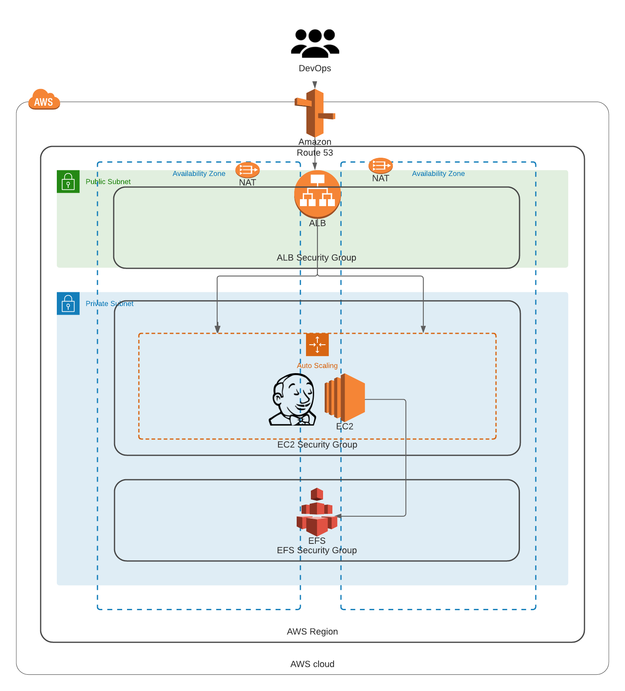

## Summary

This repo will create an auto-scaled, self healing, Jenkins Master server for use in AWS.  

## Basic Architecture



## Built with:

* Terraform (v0.14.0)
* AWS_ACCESS_KEYS and AWS_SECRET_ACCESS_KEYS are set as environment variables (link: https://docs.aws.amazon.com/cli/latest/userguide/cli-configure-envvars.html)

##### Summary:

 * Jenkins Master EC2 instance, created via an AutoScaling Group "ASG".
 * Encrypted EFS share to host $JENKINS_HOME.
 * EFS Mount points in 2x AZs.
 * DNS friendly name in Route53 for connections.
 * Application Load balancer "ALB" , forwarding to the Jenkins Master.
 * Jenkins Server rebuilds once a week deploying all the latest security patches and the latest jenkins.war. Default = 00:00 - 00:30 each Sunday morning.
 * Custom KMS encryption key for EFS.
 * HTTP - auto re-directs to - HTTPS
 * data\_sources.tf can be used to look up the latest AMI to use.

##### EFS Backups

 $JENKINS\_HOME is stored on an EFS Share. It is advisable to back this up. AWS provide 2 off-the-shelf solutions that will do this automatically:
 * https://aws.amazon.com/answers/infrastructure-management/efs-backup/. This solution is deployed via a CloudFormation template.
 * AWS Backup - https://aws.amazon.com/backup/ ( Probably more straight forward to implement )

##### Current supported Operating Systems:

 * Ubuntu Server 18.04 LTS
 * Amazon Linux 2

## Step by Step deployment for Staging Environment
* **Step 1: Clone the Repo**. This command will clone the repo and will change directory the recently cloned repo
```shell script
$ git clone https://github.com/antonio-rufo/jenkins.git
```

* **Step 2: Create a S3 bucket for remote state storage at Organization level.** Update the `terraform.tfvars` file with your account ID and region and environment
```shell script
$ cd jenkins/statebucket
$ vi terraform.tfvars
```
Create the resources:
```shell script
$ terraform init
$ terraform plan
$ terraform apply --auto-approve
```
Take note of the output for `state_bucket_id`. You'll need to update the `main.tf` on each layer with it. It is not yet possible to have the state bucket values interpolated.  


* **Step 3: Setup your base layer (VPC).** Update the `terraform.tfvars` file with your account ID, region, and environment. Then fill up all required variables. Then update `main.tf` with the **state_bucket_id** created in step 2 (line 10) as well as the **region** (line 12).
```shell script
$ cd ../layers/000base
$ vi terraform.tfvars
$ vi main.tf
```
Create the resources:
```shell script
$ terraform init
$ terraform plan
$ terraform apply --auto-approve
```

* **Step 4: Setup your data layer (EFS).** Update the `terraform.tfvars` file with your account ID, region, and environment. Then fill up all required variables. Then update `main.tf` with the **state_bucket_id** created in step 2 (line 10 and 30) as well as the **region** (line 12 and 32).
```shell script
$ cd ../100data
$ vi terraform.tfvars
$ vi main.tf
```
Create the resources:
```shell script
$ terraform init
$ terraform plan
$ terraform apply --auto-approve
```

* **Step 5: Setup your compute layer (ALB, ASG, and Route53).** Update the `terraform.tfvars` file with your account ID, region, and environment. Then fill up all required variables. Then update `main.tf` with the **state_bucket_id** created in step 2 (line 10, 30, and 42) as well as the **region** (line 12, 32, and 44).
```shell script
$ cd ../200compute
$ vi terraform.tfvars
$ vi main.tf
```
Create the resources:
```shell script
$ terraform init
$ terraform plan
$ terraform apply --auto-approve
```
